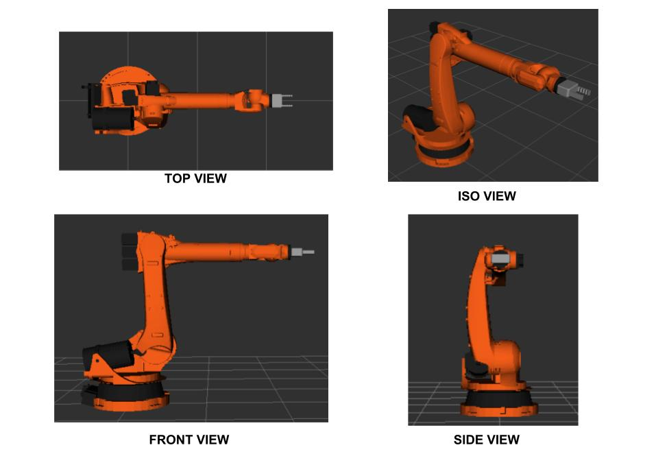
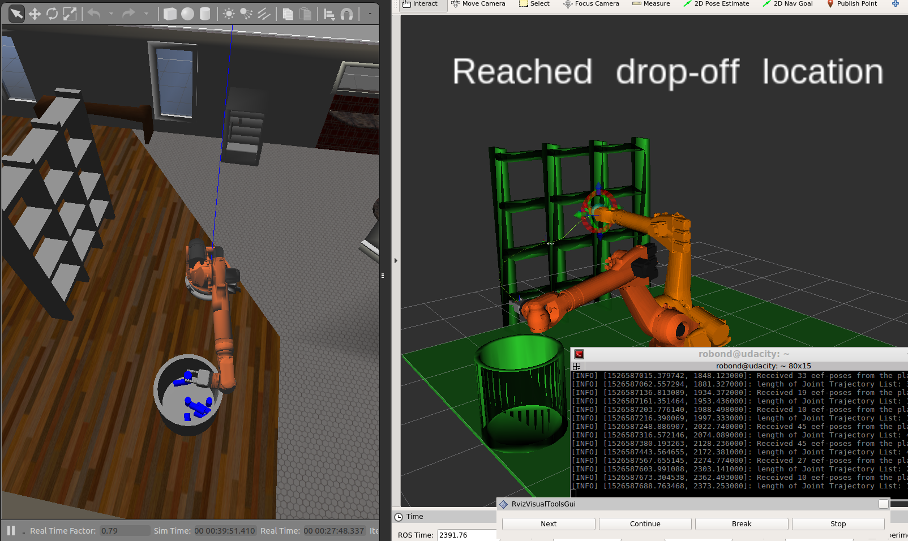

Jupyter Notebook
README Last Checkpoint: Last Tuesday at 6:43 PM (unsaved changes) Current Kernel Logo

Python 2

    File
    Edit
    View
    Insert
    Cell
    Kernel
    Widgets
    Help

## Project: Kinematics Pick & Place

​

### Project Introduction

​

This project was designed by the team at [Udacity](https://www.udacity.com/course/robotics-software-engineer--nd209) in order to teach a variety of robotics concepts to students. Some of the key concepts touched on in this project are:

* Robot Operating System (ROS) - Using Kinetic Distro.

 * Master - roscore

 * Compute Graphs

 * Packages

 * Nodes

 * Catkin workspaces

 * Topics

   * Messages

   * Publisher-Subscriber Architecture

 * Services (One to one messages)

 * Rviz 3D Visualization

 * Moveit! motion planning, kinematics, and robotics control

 * Gazebo 3D simulation

* Robot Kinematics

 * Homogenous Tranformations

 * Forward Kinematics

 * Inverse Kinematics

 * DH Parameters

 * Industrial robot structures

   * SCARA

   * CARTESIAN

   * etc.

 * Universal Robot Description Fortmats (URDFs)

​

The overall goal of this project was to develop the necessary forward and inverse kinematics for a Kuka KR210  Robot and computationally simulate a bin-picking application with the applied theory. The Robot was simulated  and controlled with the help of ROS, Gazebo, MoveIt!, and Rviz.

​

### Forward Kinematic (DH) Analysis

​

A Kuka KR210 basic drawing is shown below, gathered from data in ROS's Rviz visualization package:

​



​

From the front view, we can gather useful information about the robots joints in it's "zero" configuration - the position the robot is in when it is first spawned in simulation:

​


​

The URDF file should describe the robot in it's zero confiuration, when all joint values are equal to zero, but this is not always the case. From this information we can start deriving the Kuka's [DH parameters](https://en.wikipedia.org/wiki/Denavit%E2%80%93Hartenberg_parameters). The first step is to label all of the nodes from 1 to N:

​


​

Step 2 of deriving the DH parameters is to define the joint axes. Note below the yellow dots on the joints indicate axes coming out of the viewing medium. 

​


​

Steps 3 and 4 are to draw and label each link of the robot from 0 to N (N=6):

​


​

The next step is to assign positive axes for each link - Let's simplify the drawing a little as well. Notice that a frame has been added for the gripper, as its position is desired. The X axes define the common normals between Z(i-1) and Z(i)


​

The next step is to determine the distances between each non-zero link length and offsets. a(i-1) is the distance from z(i-1) to z(i) measured along x(i-1). d(i) is the distance between x(i-1) and x(i) measured along the z(i) axis.


​

The twist angles (alpha) are the angles between the z(i) and z(i+1) axes, measured about x(i):

​

 i | alpha(i) 

--- | ---  

0 | 0 

1 | -pi/2 

2 | 0 

3 | -pi/2

4 | pi/2 

5 | -pi/2 

6 | 0 

​

The KR210 is made up of all relvolute joints, and therefore the only variables are thetas. Theta(i) is the angle between x(i-1) and x(i) measured about z(i).

​

From this information, we can derive the DH parameter table for the KR 210 Robot. Each row is the transform from link(i-1) to link(i).

​

​

|      i      | alpha(i-1) | a(i-1) |   d(i)  |    theta(i)    |

|:-----------:|:----------:|:------:|:---------:|:--------------:|

|  1 (0-->1)  |      0     |    0   |     d1    |     theta1     |

|      2      |    -pi/2   |   a1   |     0     | -pi/2 + theta2 |

|      3      |      0     |   a2   |     0     |     theta3     |

|      4      |    -pi/2   |   -a3  |     d4    |     theta4     |

|      5      |    pi/2    |    0   |     0     |     theta5     |

|      6      |    -pi/2   |    0   |     0     |     theta6     |

| EE (6-->EE) |      0     |    0   | d_gripper |        0       |

​

​

From the URDF file describing the Kuka arm, we can find information about the joint positions under the joint's heading and therefore, the DH Parameter table can be filled out as follows:

​

​

|      i      | alpha(i-1) | a(i-1) | d(i) |  theta(i)  |

|:-----------:|:----------:|:------:|:------:|:----------:|

|  1 (0-->1)  |      0     |    0   |  0.75  |     q1     |

|      2      |    -pi/2   |  0.35  |    0   | -pi/2 + q2 |

|      3      |      0     |  1.25  |    0   |     q3     |

|      4      |    -pi/2   | -0.054 |   1.5  |     q4     |

|      5      |    pi/2    |    0   |    0   |     q5     |

|      6      |    -pi/2   |    0   |    0   |     q6     |

| EE (6-->EE) |      0     |    0   |  0.303 |      0     |

​

​

Utilizing the DH parameter table derived above, we can create 4x4 homogenious transformation matricies about each joint, based on the following relation for DH parameters: 

​


​

For example, the homogenious tranformation matrix derived from the first row of the DH parameter table, corresponding to the transformation between links 0 and 1, can be written as follows (please refer to appendix A for a list of all of the individual transformation matrices -  obtained from `pprint(TF)` in `sympy`):

​


​

The total transformation from the base of the Kuka Robot can then be found by chaining these transformations together:

​


​

​

To check that the individual DH parameter tranformations are correct, a basis vector (example i(hat), j(hat)) of link(i-1) should be transformed into the basis vector of link(i), after a homogeneous transform is applied; x_0 should map to x_1, z_0 should map to z_1.

​

​

One thing to note about these transformations, however, is that the joint origins/orientations in the URDF are not the same as the frame origins/orientations of the DH parameter analysis. In the URDF file, each joint is defined relative to its parent link. In order to account for the differences between the URDF file and the DH parameter analysis, we need to apply a series of rotations described by a rotation matrix we will denote as `R_corr`.

​

### Inverse Kinematic Analysis of the Kuka KR210

​

Inverse kinematics is the much more difficult problem of solving for the joint variables of a robotic system based on the pose of the end effector. This problem is highly non-linear (involves a lot of inverse triginometric functions) and often results in many (or no) possible solutions to a given problem - it is up to the analyzer to determine the intended, or most efficient, solution.

​

The inverse kinematic problem can be solved with two main approaches - numerically or analytically (ref - Udacity Robotics Engineer Nanodegree - Lesson 11, Section 18). Numerical computation is utlizied in many areas of engineering/science and is an extremly well studied and mature field, but in many cases it is too computationally expensive to be used to solve real time problem: for these reasons an analytic, or "closed form" soltion is almost always prefered. 

​

It's not always the case that a closed form solution can be found for the inverse kinematic problem unless certain requirements have been met in the robot's design; namely, if a robot has three single neighbouring joints that meet in a single point, or has three neighbouring joint axes that are parallel, then we can find a closed form solution to the problem. In the case of the Kuka KR210, it is evident that the last three joints of this robot have joint axes that meet meet in a single point (the second last joint's origin). This feature of the Kuka KR210, named a "spherical wrist" allows us to kinematically decouple the problems of solving for the position and the orintation of the end effector; we can simply solve for the coordinates of the wrist center (based on the first 3 joints of the robot) and the orientation of the end effector (based on the last 3 joints) separately. 

​

Having already completed the DH parameter table for the robot with the origin of frames 4,5, and 6 coincident with the wrist center of the robot, we can find the location of the wrist center relative to the base frame of the robot. We know that the transform between the base link of the robot and it's end effector can be written as follows (img source: Udacity nano-degree program - Lesson 11, section 18):

​


​

With the above information, and by knowing that the robot's end effector is a constant offset (say `d`) away from the wrist center in the direction of the last joint's axis, we can find the vector (coordinates) from the robot's base link to the wrist center as follows: 

​


​

Therefore in order to solve the problem, joint angles 1, 2, and 3 must be solved for such to make the wrist center coordinates coindident with the above relation. To maintain consistency with the Udacity Robotic Nanodegree program, lets assume that the overal transformation matrix from the robot's base to its end effector is

​


​

where l, m, and n are vectors representing the endeffector's orientation, and p represents then end-effector's posiiton. From this, we can find the vector W, which represents the wrist center coordinates as follows:

​


​

In the above relation, `d_6` can be found in the previously derived DH table and `l` is the end-effector length. The `n` vector is used to calculate the wrist center because it is coincident with the offset from the wrist center to the end effector. The first three joint angles can now be determined using simple trigonometry. `theta 1`, the first joint angle, can be determined simply with

​


​

and `theta 2` and `theta 3` can be found utilizing the triangle diagram below.

​


​

Lengths C and A are easily found as they are simply the lengths of the links and can be computed using the DH table. We can find directly that C = 1.25 and A = sqrt((-0.054)^2 + 1.5^2). The angles a, b, and c are then computed using the cosine law. From here, it is a matter of applying simple trigonometric identites to solve for `theta 2` and `theta 3`, namely that a right angle adds up to pi/2 radians (remebering the offsets based on the fact the diagram does not start at the origin/base-frame). 

​


​


​

Once the rotations (the thetas) are known for the first three joints, we can determine the rotation matrix from 0->3 (R0_3); knowing this, we can find the roation matrix from 3->6 (R3_6) by multiplying the inverse (transpose as its an orthoganal matrix) of R0_3 by the orientation of the end effector. R3_6 provides us with three equations and three unknowns in which we can solve for `theta_4`, `theta_5`, and `theta_6` (equation/img source udacity robotics software engineer nanodegree lesson 11, section 18).

​


​

Multiplying R3_4, R4_5, R5_6, we can find R3_6:

​


​

Finally, from this (using some clever algebraic and triginometric identies) we find (in code syntax):

​

```

theta_4 = atan2(R3_6[2,2], -R3_6[0,2])

theta_5 = atan2(sqrt(R3_6[0,2]*R3_6[0,2] +R3_6[2,2]*R3_6[2,2]),R3_6[1,2])

theta_6 = atan2(-R3_6[1,1], R3_6[1,0])

```

​

Note that due to the square root in `theta_5` that we can have multiple solutions for this joint angle (+/-); this does not affect `theta_4` and `theta_6`, as all possible solutions are valid.

​

### Project Implementation

​

The theoretical analysis outlined in the sections above was implemented in a python script run by ROS. RViz and Gazebo were utilized to visualize and simulate the inputs and outputs of this script. Overall, the implementation is a success - it picks and places most items without fault, however it is quite slow in running. In the future if more work were to be put into this program, it would be desireable to transfer from a symbolic math library to a compiled one (even just numpy!): this would lead to dramatic increases in mathematical computation speed; additionally to increase speed, one would want to be careful what was included in the main `for` loop that computes all of the poses - only what is required to be in this loop should be in there, as it needs to be run several times over for each path computation. 

​

Another way to increase the speed would be to subsample the robot's path points before computation. Many of these paths have too many intermediate steps for such a clear/open application space - it seems it would be OK to spread these points out further from one another which would ultimately lower computation time and also runtime. 

​

Below you will find an image of the Robot completing it's bin picking application. For any questions or concerns, please don't hesitate to give me a shout.

​



​

​

## APPENDIX A: Individual Transformaitons


